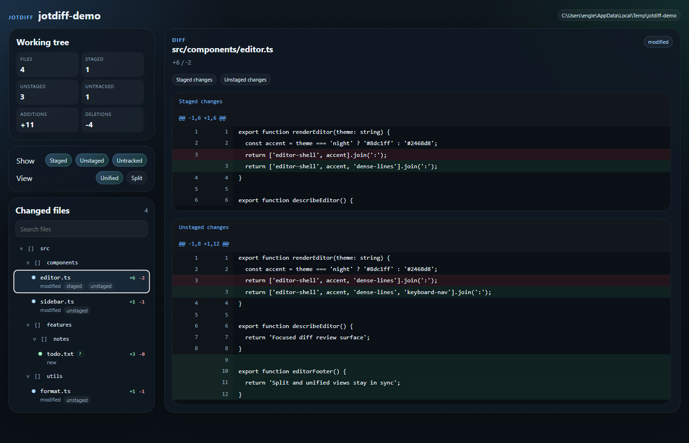
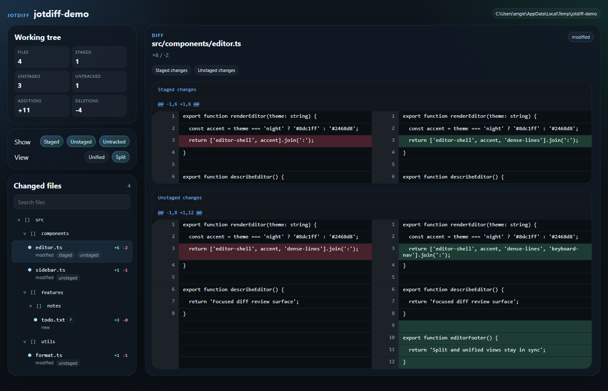

# Jotdiff

Jotdiff is a desktop Git diff viewer for people who spend a lot of time reviewing working tree changes and are tired of flipping between terminal output, editor tabs, and half-readable patch views.

It gives you a focused review surface for real day-to-day Git work:

- staged changes
- unstaged changes
- untracked files
- path-scoped launches
- unified and split diff views
- a real changed-files tree instead of a flat pile of filenames

The goal is simple: make it faster to understand what changed, where it changed, and whether the change set still looks coherent before you commit.

## Why Jotdiff Is Good

Jotdiff is useful because it combines a few things that are usually scattered across tools:

- a thin CLI launcher that opens directly into the repo and path you care about
- a desktop UI that keeps working tree review visually calm and easy to scan
- separate staged and unstaged sections when a file has both
- a collapsible directory tree so you can stay oriented in larger change sets
- incremental diff loading so the app does not fall apart the moment a repo gets messy

In practice, that means less time reconstructing context in your head and more time actually reviewing the change.

## Screenshots

Unified view:



Split view:



## Current Status

Jotdiff is working software, but it is still early-stage.

What is in place today:

- cross-platform Electron desktop app
- `jotdiff` CLI launcher
- direct launch support with `--cwd`
- working tree diff support
- staged / unstaged / untracked filters
- collapsible changed-files tree
- keyboard navigation in the changed-files list
- on-demand diff loading
- large-diff preview mode with full-load expansion
- binary / non-text detection
- Storybook for renderer components
- Playwright coverage against Storybook states

What is not done yet:

- packaged installers
- commit / staging actions from the UI
- revision or range compare workflows
- advanced diff polish like intraline highlights

## Requirements

- Node.js 20+
- Git available on `PATH`
- npm

Electron is installed as a project dependency.

## Install

```bash
npm install
```

Build everything:

```bash
npm run build
```

## CLI Usage

The CLI launches the desktop app in a specific initial state.

Link it globally during development:

```bash
npm link -w @jotdiff/cli
```

Then run it from any directory:

```bash
jotdiff
```

Useful examples:

```bash
jotdiff --cwd /path/to/repo
jotdiff --path src
jotdiff --view split
jotdiff --staged
jotdiff --unstaged
jotdiff --untracked
```

Notes:

- If no `--cwd` is provided, Jotdiff uses the current working directory.
- If any of `--staged`, `--unstaged`, or `--untracked` are provided, that explicit set becomes the initial filter state.
- `--path` sets the initial path scope.
- If the target directory is not inside a Git repository, the app opens into a non-repo explanatory state.

## Development

Run the live-reload desktop app:

```bash
npm run dev -w @jotdiff/desktop
```

Run the live-reload app against a specific directory:

```bash
npm run dev -w @jotdiff/desktop -- --cwd /path/to/repo
```

Current dev behavior:

- Vite serves the renderer on port `5174`
- renderer changes hot reload
- Electron main/preload changes restart the app

## Storybook

Start Storybook for the renderer components:

```bash
npm run storybook -w @jotdiff/desktop
```

Build the static Storybook output:

```bash
npm run build-storybook -w @jotdiff/desktop
```

## Testing

Run package tests:

```bash
npm test
```

Run Playwright tests against Storybook:

```bash
npm run test:playwright
```

Run everything:

```bash
npm run test:all
```

## Repository Layout

```text
apps/
  cli/       Thin Node launcher for Electron
  desktop/   Electron main/preload + React renderer

packages/
  git-core/       Git discovery, change loading, diff loading
  session-core/   Session creation and repo/non-repo app state
  shared-types/   Shared application types

tests/
  helpers/
  playwright/
```

## Architecture

- `apps/cli` parses launch flags and opens Electron.
- `apps/desktop/src/main` owns launch state, session loading, and IPC.
- `packages/git-core` talks to Git and builds file/diff data.
- `packages/session-core` resolves repository vs non-repository sessions.
- `apps/desktop/src/renderer` renders the shell, file tree, and diff views.

The renderer does not scan Git directly. It asks the Electron main process for session and diff data over IPC.

## Design Goals

- fast working-tree review
- practical defaults
- clear navigation through changed files
- good-looking diff presentation without copying GitHub literally
- incremental loading so large change sets stay usable

## Limitations

- The primary workflow today is working tree review, not historical compare.
- Direct launch depends on the process working directory being meaningful.
- Large diffs are previewed first and may require explicit full loading.
- Binary files are detected and shown as non-text placeholders instead of rendered diffs.

## License

No license file has been added yet.
